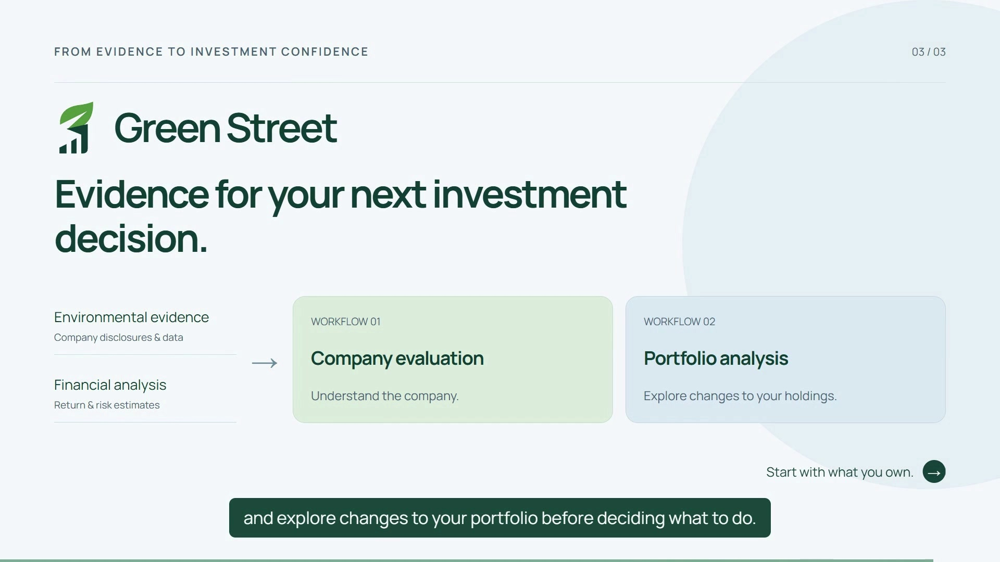
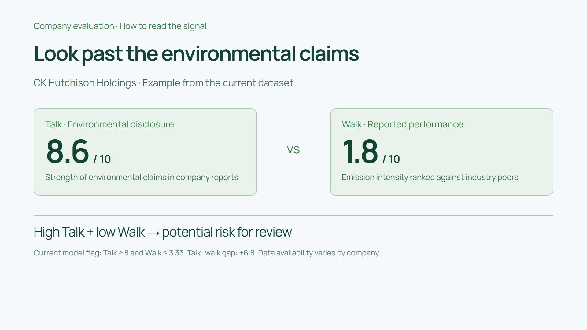
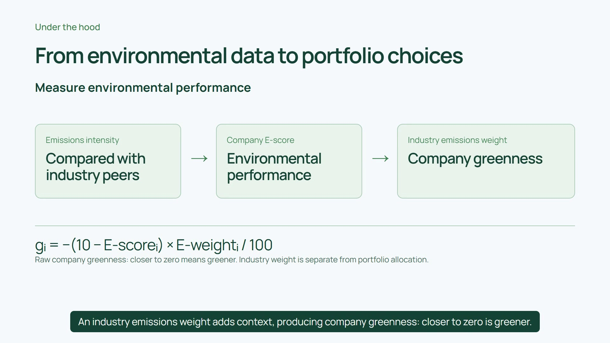
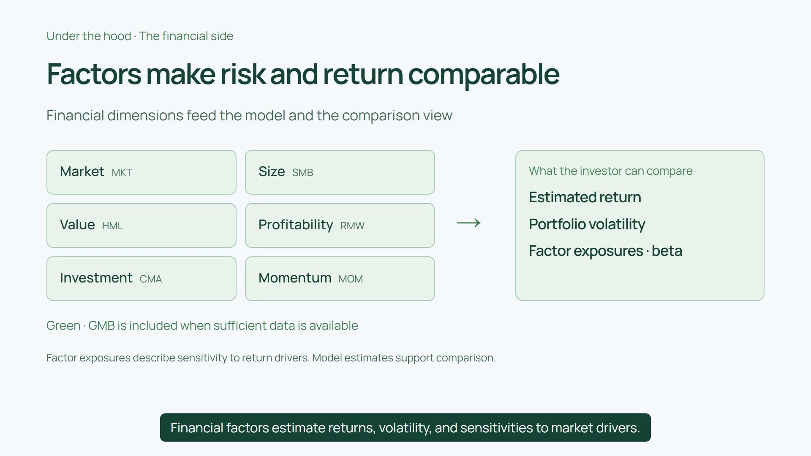
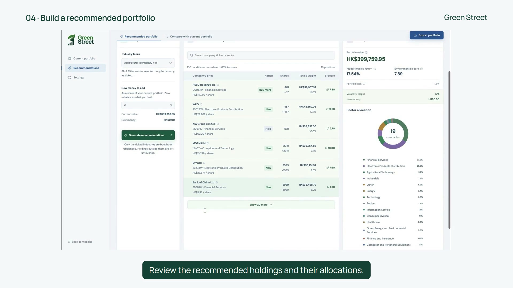
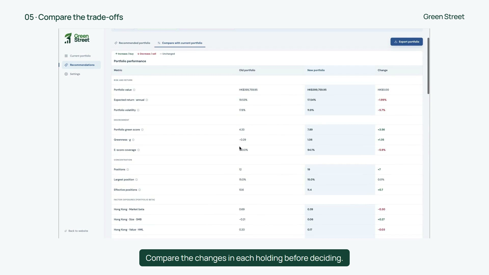
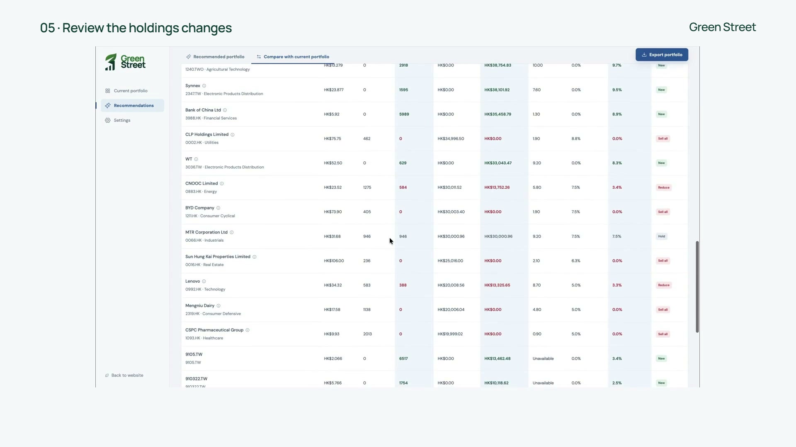

# Green Street
Environmental portfolio analysis for retail investors — a team project.

Green Street connects company environmental evidence with portfolio analysis: review environmental claims and reported performance, set investment preferences, and compare a proposed portfolio with your current holdings before making a decision.

**[Watch the full demo and read the project story →](https://studio.pachin1919.workers.dev/work/green-street)** · [Open the integrated workspace](https://green-street-272061343685.asia-east2.run.app/app) · [Explore the analysis engine](engine/README.md)

> we make your wallet and the streets green

## Product and methodology showcase

### Official website


### Portfolio workspace


The two images above were captured from the deployed application on 8 October 2026. The following seven images are full-frame captures from the product demo, combining explanatory slides with recorded interface views. They document the demonstrated flow rather than guarantee the current deployment looks identical.

### Two connected workflows



Evaluate a company, then explore portfolio changes. Environmental indicators add context to the decision alongside financial risk and return.

### Environmental claims versus performance



**Talk** measures environmental disclosure; **Walk** measures emissions intensity relative to industry peers. The model flags high Talk (≥ 8) together with low Walk (≤ 10/3) for closer review. A positive Talk–Walk gap alone is not the flag, and the signal is not proof of misconduct. Coverage depends on the available company data. [Implementation](engine/src/esgx/measures/greenwash.py).

### Under the hood: company greenness



The engine computes `g = −(10 − E_score) × E_weight / 100`: `E_score` is the Walk score and `E_weight` reflects the industry's aggregate emissions intensity. Raw company greenness closer to zero is greener. This environmental measure is distinct from a full ESG rating, portfolio allocation weights, and factor exposure. [Implementation](engine/src/esgx/measures/greenness.py).

### Financial factors and portfolio estimates



Market, size, value, profitability, investment and momentum factors support model-implied return, volatility and sensitivity estimates. Green-minus-brown (GMB) enters when sufficient data is available. Factor exposure describes sensitivity to a return driver; it is different from the company's greenness characteristic. [Model inputs](engine/src/esgx/portfolio/inputs.py) · [Recommendation logic](engine/src/esgx/portfolio/recommend.py).

### Recommended portfolio



Import current holdings, set risk tolerance and green preference, choose the investment inputs, and review the proposed allocations. The recommendation engine combines financial modeling with environmental targets and a turnover penalty.

### Compare the trade-offs



Compare environmental score, model-implied return and volatility together. An improvement in one measure may involve a trade-off in another; the displayed estimates are not guaranteed future returns.

### Inspect the holding changes



Review changes in share counts, invested amounts and allocations before exporting the proposed holdings. Trades are carried out separately through the investor's broker.

### Project contributions

This is a team project. Pachin's contributions include the initial frontend UI and interaction prototypes, product narrative, explanatory animations, and demo video production. The integrated interface, analysis algorithms and data pipelines include other team members' work.

The complete video and personal contribution walkthrough are hosted on the [Green Street project page](https://studio.pachin1919.workers.dev/work/green-street). This repository keeps the screenshots and implementation alongside their context.

## Initial UI prototypes

The sections below describe the original mock-data frontend prototypes, separately from the integrated product and analysis engine shown above.

React + TypeScript + Vite frontend with two distinct layouts:

| Version | Visual direction | Local route |
| --- | --- | --- |
| Clarity blue | White and pale blue; portfolio analysis workspace | `/?v=blue` |
| Sage green | White and pale green; guided investor experience | `/?v=green` |

**Green Street**

> we make your wallet and the streets green

### Run locally

Use Node.js 22.12+ (validated with Node.js 24).

```sh
git clone https://github.com/Pachin1919/green-street.git
cd green-street
npm ci
npm run dev
```

Open <http://127.0.0.1:4319/?v=blue> or <http://127.0.0.1:4319/?v=green>. The top switch changes versions. On Windows, `start-demo.cmd` also starts the local server. Localhost links work only on the computer running the app.

```sh
npm run build
npm run preview
```

### Implemented interactions

- Portfolio search and sorting; company details with keyboard focus restoration.
- Environmental score, industry importance, Carbon / Walk / Talk explanations.
- Independent allocation draft with 100% validation and before/after comparison.
- Empty, loading, partial-data and error states; sample JSON export.
- Responsive layouts and reduced-motion support.

All companies and metrics are fictional. Missing data remains unavailable. Allocation comparisons run locally; no live backend, expected-return forecasts, portfolio optimisation, trading or full ESG rating is provided. The research hypothesis that greenness relates to returns has not been validated by this frontend.

### Project structure

```text
src/App.tsx          Two layouts, company detail and allocation flows
src/data.ts         Fictional fixtures and frontend capability definitions
src/styles.css      Colours, typography, responsive layouts and motion
docs/demo-guide.md  Detailed Chinese demo and implementation guide
```

The frontend view model is not a confirmed backend API contract. Keep a future API adapter separate from the UI. This repository is not automatically connected to Lovable.

Validation: TypeScript and production build passed; key interactions checked in a browser; both versions checked at 320, 390, 768 and 1440 px. Dependencies, build output and local browser traces are excluded from Git.
