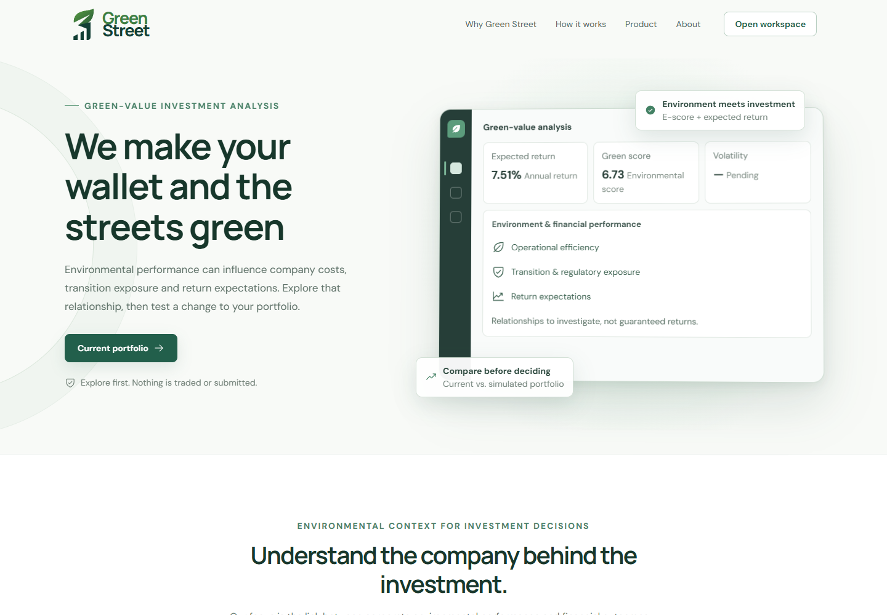
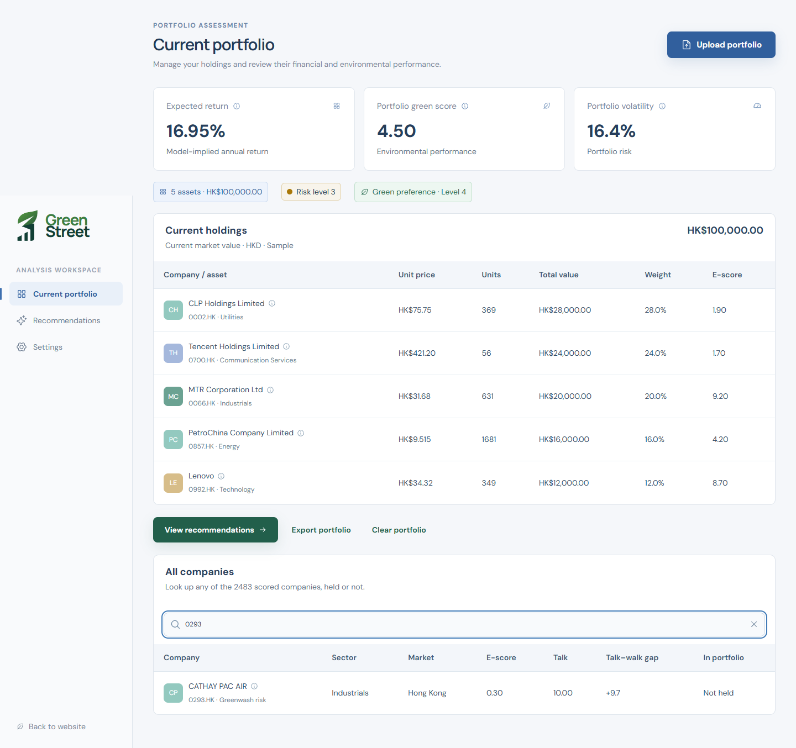
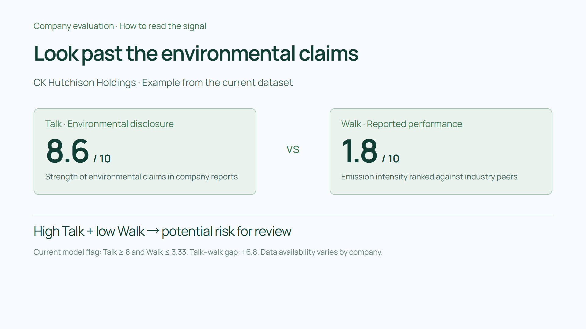
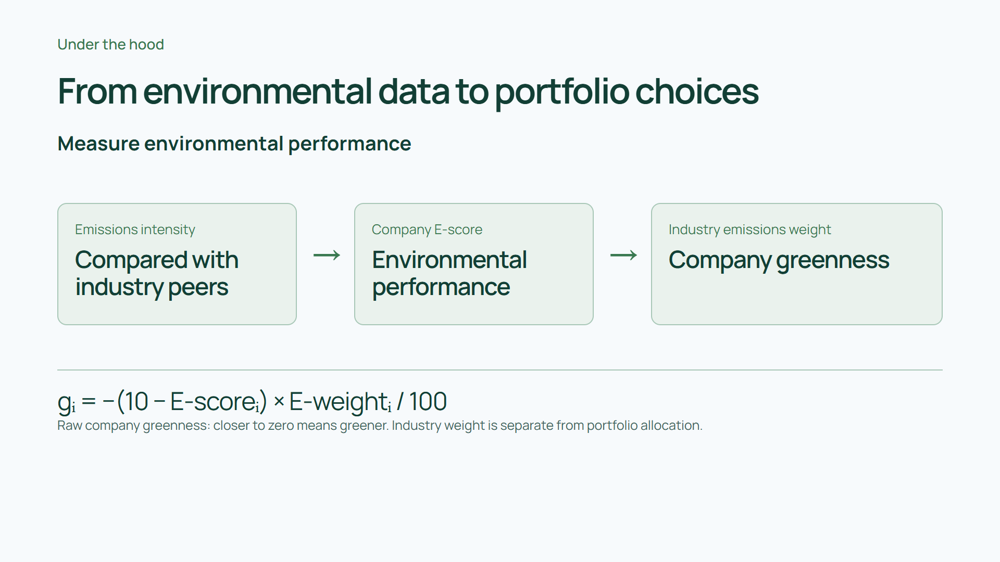
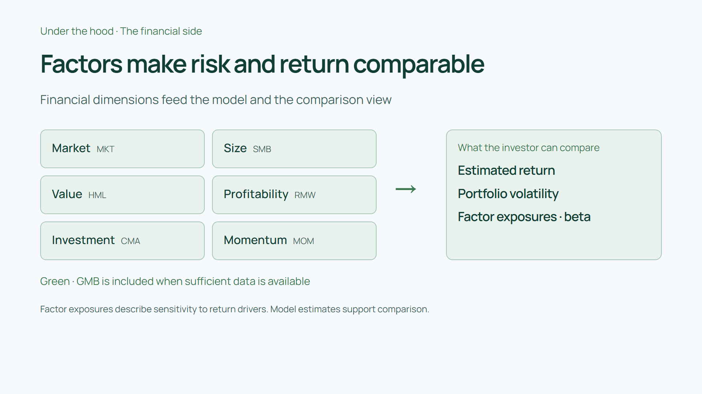
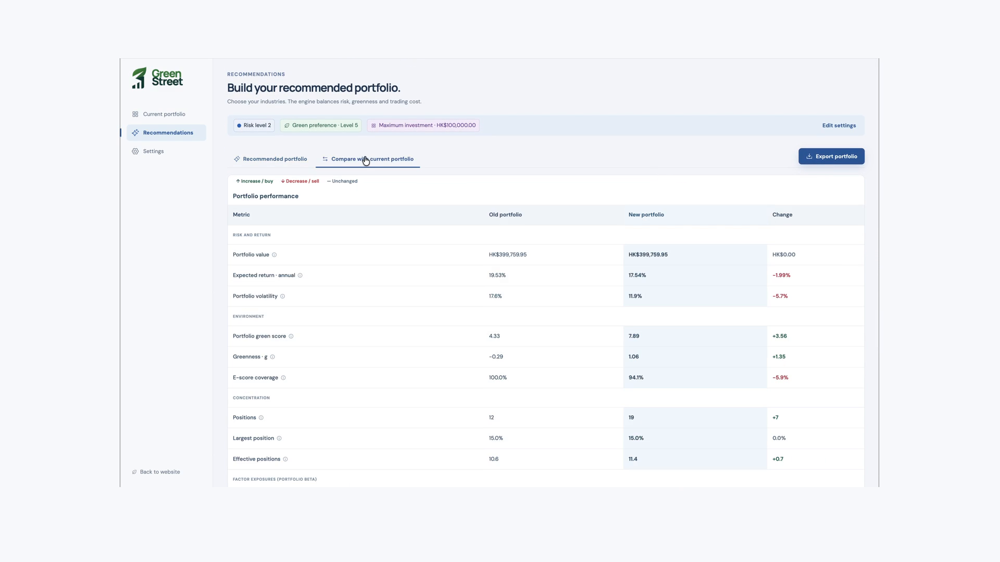

# Green Street
Environmental portfolio analysis for retail investors — a team project.

> we make your wallet and the streets green

Green Street helps retail investors connect company environmental evidence with the financial characteristics of their portfolio. Evaluate a company, explore a proposed allocation, and compare the trade-offs before deciding what to do.

**[Watch the demo & project story →](https://studio.pachin1919.workers.dev/work/green-street)** · [Try the workspace](https://green-street-272061343685.asia-east2.run.app/app) · [Analysis engine](engine/README.md)



## From current holdings to a proposed portfolio

1. **Import** your current portfolio and review the holdings.
2. **Choose** risk tolerance, green preference and investment inputs.
3. **Review** recommended allocations, compare metrics and inspect holding changes.
4. **Export** the proposed holdings; execute any trades separately through your broker.



## How the analysis works

### 1. Compare claims with environmental performance

**Talk** measures environmental disclosure. **Walk** measures emissions intensity relative to industry peers. High Talk (≥ 8) combined with low Walk (≤ 10/3) triggers a potential greenwashing signal for closer review. A positive gap alone is not the flag; the signal is not proof of misconduct. [Source](engine/src/esgx/measures/greenwash.py).



### 2. Turn environmental evidence into company greenness

The engine computes `g = −(10 − E_score) × E_weight / 100`. `E_score` is the Walk score; `E_weight` adds the industry's emissions-intensity context. Raw company greenness closer to zero is greener. Industry weight and portfolio allocation are different quantities. [Source](engine/src/esgx/measures/greenness.py).



### 3. Combine environmental targets with financial modeling

Market, size, value, profitability, investment and momentum factors support model-implied return, volatility and factor exposure estimates. Green-minus-brown (GMB) enters when sufficient data is available. The recommendation model combines financial inputs, environmental targets and a turnover penalty to propose allocations. [Model inputs](engine/src/esgx/portfolio/inputs.py) · [Recommendation logic](engine/src/esgx/portfolio/recommend.py).



## Compare the result before making a decision

Review current versus proposed environmental score, model-implied return, volatility and concentration, then inspect share counts and invested amounts. Improvements can involve trade-offs: the tool supports comparison rather than promising future returns.



The hero and workspace images were captured from the deployed application on 8 October 2026. Methodology illustrations come from the demo's original animation pages; the comparison comes from the original product recording. All six images are free of video subtitle overlays. Recorded views may differ from the current deployment. Environmental analysis is distinct from a full ESG rating, and coverage depends on available data.

## Team and contributions

Pachin contributed the initial frontend UI and interaction prototypes, product narrative, explanatory animations and demo video production. The integrated interface, analysis algorithms and data pipelines include other team members' work.

See the full demo and personal contribution walkthrough on the [Green Street project page](https://studio.pachin1919.workers.dev/work/green-street). Technical documentation is in the [analysis engine README](engine/README.md).

## Development reference

<details>
<summary>Initial UI prototypes — setup, scope and validation</summary>


The sections below describe the original mock-data frontend prototypes, separately from the integrated product and analysis engine shown above.

React + TypeScript + Vite frontend with two distinct layouts:

| Version | Visual direction | Local route |
| --- | --- | --- |
| Clarity blue | White and pale blue; portfolio analysis workspace | `/?v=blue` |
| Sage green | White and pale green; guided investor experience | `/?v=green` |

### Run locally

Use Node.js 22.12+ (validated with Node.js 24).

```sh
git clone https://github.com/Pachin1919/green-street.git
cd green-street
npm ci
npm run dev
```

Open <http://127.0.0.1:4319/?v=blue> or <http://127.0.0.1:4319/?v=green>. The top switch changes versions. On Windows, `start-demo.cmd` also starts the local server. Localhost links work only on the computer running the app.

```sh
npm run build
npm run preview
```

### Implemented interactions

- Portfolio search and sorting; company details with keyboard focus restoration.
- Environmental score, industry importance, Carbon / Walk / Talk explanations.
- Independent allocation draft with 100% validation and before/after comparison.
- Empty, loading, partial-data and error states; sample JSON export.
- Responsive layouts and reduced-motion support.

All companies and metrics are fictional. Missing data remains unavailable. Allocation comparisons run locally; no live backend, expected-return forecasts, portfolio optimisation, trading or full ESG rating is provided. The research hypothesis that greenness relates to returns has not been validated by this frontend.

### Project structure

```text
src/App.tsx          Two layouts, company detail and allocation flows
src/data.ts         Fictional fixtures and frontend capability definitions
src/styles.css      Colours, typography, responsive layouts and motion
docs/demo-guide.md  Detailed Chinese demo and implementation guide
```

The frontend view model is not a confirmed backend API contract. Keep a future API adapter separate from the UI. This repository is not automatically connected to Lovable.

Validation: TypeScript and production build passed; key interactions checked in a browser; both versions checked at 320, 390, 768 and 1440 px. Dependencies, build output and local browser traces are excluded from Git.

</details>
